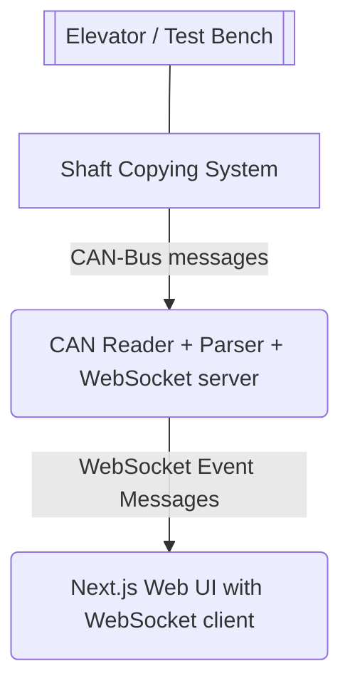

# LES02 Web UI

**Design Document**

## 1. Overview

### 1.1 Purpose

This project provides a web-based user interface for technicians operating elevator component test benches.
Its primary goal is to **visualize elevator ride curves in real time**, allowing technicians to objectively assess and fine-tune mechanical valve parameters to achieve an optimal, standardized ride profile.

In one sentence:

> An internal tool for test bench technicians to visualize elevator ride curves in real time in order to reduce guesswork when mechanically adjusting control valves.

---

### 1.2 Context

The company manufactures elevator components, primarily mechanical control valves.
Due to manufacturing tolerances, each valve must be individually pre-adjusted on a test bench before shipment.

Currently:

* Valve tuning is done heuristically.
* Multiple test runs are required.
* Multiple mechanical parameters influence the ride curve, often with overlapping effects.
* Test benches are a production bottleneck.

The software is intended to:

* Remove guesswork from the tuning process.
* Improve consistency across batches.
* Reduce tuning time per valve.
* Establish a foundation for future data-driven optimization.

---

## 2. Target Users

### Primary Users

* Test bench technicians

### Secondary / Future Users

* Field service technicians
* Installation technicians at customer sites

### User Characteristics

* Technically skilled, but not software developers
* Expect reliability and clarity over feature richness
* UI must be usable with minimal explanation

---

## 3. Deployment & Runtime Context

### 3.1 Initial Deployment

* Stack runs locally on:

  * Raspberry Pi mounted at the test bench **or**
  * Technician laptop
* No cloud dependency
* No mandatory internet connection

### 3.2 Future Possibilities (Out of Scope for Prototype)

* Permanent installation inside an elevator
* Long-term data collection for R&D
* Automated parameter optimization

---

## 4. System Architecture (High-Level)



### Key Principles

* Simple and robust
* No unnecessary distributed complexity
* Fail-safe behavior preferred over feature completeness

---

## 5. Data Sources

### 5.1 Live Data (Prototype & Final)

Live ride data is provided by a Python-based CAN bus listener and streamed to the Web UI via WebSocket.

#### Transport

* Protocol: WebSocket
* Direction: Server → Client (broadcast-only)
* Encoding: JSON
* Message granularity: single sample per message

There is **no request/response pattern**.
The Web UI passively consumes a continuous stream of events.

---

### 5.1.1 WebSocket Event Protocol

All WebSocket messages follow a strict envelope format defined by the `EventEnvelope` data structure.

#### EventEnvelope Schema

```json
{
  "proto": 1,
  "type": "position_sample",
  "ts": 1768823176.4770832,
  "source": "les02",
  "payload": { ... }
}
```

##### Fields

| Field   | Type    | Description                                           |
| ------- | ------- | ----------------------------------------------------- |
| proto   | integer | Protocol version. Used for forward compatibility.     |
| type    | string  | Event type identifier. Currently `"position_sample"`. |
| ts      | number  | Unix timestamp in seconds (float, high precision).    |
| source  | string  | Identifier of the emitting system (e.g. `"les02"`).   |
| payload | object  | Event-specific data payload.                          |

---

### 5.1.2 `position_sample` Event

This is currently the **only event type** emitted by the listener and represents a single position measurement at a specific point in time.

#### Payload Schema

```json
{
  "channel": "master",
  "position_raw": 144
}
```

##### Payload Fields

| Field        | Type   | Description                                             |
| ------------ | ------ | ------------------------------------------------------- |
| channel      | string | Measurement channel. Currently `"master"` or `"slave"`. |
| position_raw | number | Raw position value as provided by the CAN bus.          |

Each incoming WebSocket message corresponds to **exactly one position sample**.

---

### 5.1.3 Temporal Characteristics

* Events are emitted at a high and steady frequency during a run.
* Samples from different channels (`master`, `slave`) are interleaved.
* Ordering is defined implicitly by the `ts` timestamp.
* No explicit “run start” or “run end” events currently exist.

The Web UI must:

* Sort and process samples based on timestamp.
* Decide how to visually represent multiple channels (overlay, toggle, or selection).
* Handle partial or missing data gracefully.

---

### 5.2 Historical Data (Final Version)

For the production version, completed runs will be persisted locally in a SQLite database.

> Historical storage is **out of scope for the prototype** and intentionally underspecified at this stage.

Conceptually:

* Each run represents a continuous sequence of `position_sample` events.
* Samples will likely be stored as a JSON array to preserve temporal precision.
* Metadata such as start/end timestamps will be stored separately.

The Web UI should treat historical data as **structurally equivalent** to live data to maximize code reuse.

> Note: Database schema is intentionally undefined at this stage.

---

## 6. Functional Requirements

### 6.1 Prototype Scope (Phase 1)

**Single Page Application**

Features:

* Establish WebSocket connection
* Receive live ride data
* Render a live-updating line chart:

  * X-axis: time
  * Y-axis: position
* Continuous updates during a run
* Visual clarity over precision tooling

Explicitly out of scope:

* Persistence
* Authentication
* Configuration UI
* Historical data browsing

---

### 6.2 Final Version Scope (Phase 2)

Additional features:

* Reference ride curve overlay (standardized curve)
* Historical run browser:

  * Table of previous runs (date/time)
  * Selectable entries
* Comparison view:

  * Recorded run vs reference curve
* Improved error reporting and diagnostics

---

## 7. UX & UI Design

### 7.1 Design Principles

* Minimalistic
* Professional
* Calm and technical
* No visual clutter
* Consistent design language

### 7.2 Styling

* Primary theme: Dark mode
* Light mode fully supported via toggle
* UI components:

  * Prefer `shadcn/ui`
  * Custom components must visually integrate with shadcn defaults
* Typography and spacing follow Tailwind defaults

### 7.3 Layout (Prototype)

* Single page
* Full-width chart as primary focus
* Minimal status indicators:

  * Connection state
  * Data flow indicator

---

## 8. Charting & Visualization

### 8.1 Requirements

* Live-updating line chart
* Smooth visual updates
* Must handle continuous incoming data
* Clear differentiation of curves (later phase)

### 8.2 Open Decision

Charting library not yet finalized:

* shadcn/ui charts
* Recharts
* Custom SVG/Canvas implementation
* Framer Motion assisted rendering

Decision criteria:

* Performance with live data
* Maintainability
* Visual clarity

---

## 9. Error Handling & Stability

### Core Requirement

> The software must never silently fail.

### Examples

* WebSocket disconnected:

  * Clear UI message
  * Automatic reconnect
* No incoming data:

  * Explicit “waiting for data” state
* Partial data:

  * Display what is available
  * No crashes

---

## 10. Technical Guidelines

* Next.js 16
* React 19
* Modern App Router architecture
* TypeScript mandatory
* Code, comments, and technical documentation in English
* User-facing texts in German
* Clean separation of concerns
* Maintainable and readable code preferred over micro-optimizations

---

## 11. Non-Goals

* No cloud backend
* No user accounts
* No real-time valve control
* No predictive or automated tuning (for now)
* No premature optimization

---

## 12. Success Criteria

### Prototype is successful if:

* A technician can visually assess a ride curve live
* The UI is stable and responsive
* The visualization is immediately understandable
* Stakeholders can clearly see future potential

---

## 13. Open Questions

* Final WebSocket message format
* Exact definition of a “reference ride curve”
* Charting library choice
* Hardware constraints of target Raspberry Pi
